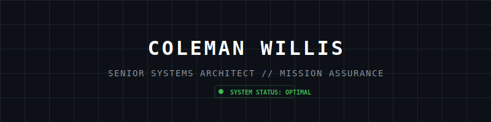
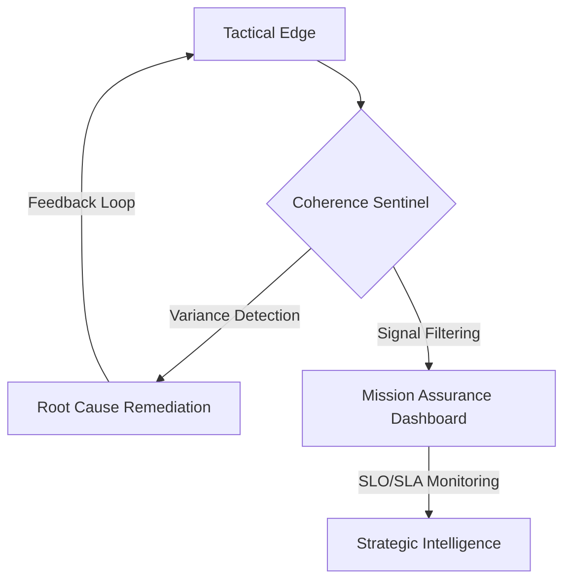

<p align="center">
  
</p>

<p align="center">
  <b>Dedicated to the engineering of high-resiliency infrastructure and the liquidation of technical debt in mission-critical environments.</b><br>
  <i>Specialist in variance-based anomaly detection, NIST compliance, and zero-trust container orchestration.</i>
</p>

---

### 🛡️ Technical Core

<table width="100%">
  <tr>
    <td width="33%" valign="top">
      <h4>Mission Assurance</h4>
      <ul>
        <li>NIST SP 800-190</li>
        <li>NIST SP 800-207</li>
        <li>RMF Alignment</li>
        <li>Security Hardening</li>
      </ul>
    </td>
    <td width="33%" valign="top">
      <h4>Reliability Engineering</h4>
      <ul>
        <li>Signal Filtering</li>
        <li>ARCR Framework</li>
        <li>SLO/SLA Optimization</li>
        <li>Root Cause Analysis</li>
      </ul>
    </td>
    <td width="33%" valign="top">
      <h4>Cloud Native</h4>
      <ul>
        <li>Docker Sidecars</li>
        <li>K8s Orchestration</li>
        <li>Air-Gapped Ops</li>
        <li>Zero-Trust Mesh</li>
      </ul>
    </td>
  </tr>
</table>

---

### 🚀 Featured Project: Coherence SRE

> **A deterministic SRE sentinel designed for predictive failure detection in contested environments.**

```yaml
system: "Coherence SRE"
status: "v1.0.0 Obsidian (Industrial Grade)"
provenance: "DOI 10.5281/zenodo.18002927"
integrity: "GPG-Signed Artifact"
security: "Supply Chain Verified"
```

<details>
<summary><b>View System Architecture Diagram</b></summary>



</details>

---

### 🔬 Research & Provenance

**Technical Brief:** *“Coherence SRE: A Derivative-Based Anomaly Detection Framework for Mission Assurance”*
Archived at: [Zenodo (DOI: 10.5281/zenodo.18002927)](https://doi.org/10.5281/zenodo.18002927)

---

### 📡 Contact / Sovereignty

<table width="100%">
  <tr>
    <td><b>Location:</b> Aurora, CO</td>
    <td><b>Email:</b> <a href="mailto:colemanwillis@blackglasscontinuum.com">colemanwillis@blackglasscontinuum.com</a></td>
  </tr>
  <tr>
    <td><b>CAGE Code:</b> [17TJ5]</td>
    <td><b>Status:</b> Mission-Ready</td>
  </tr>
</table>

```text
-----BEGIN PGP SIGNED MESSAGE-----
Hash: SHA512

TRUST BUT VERIFY: SYSTEM ARCHITECT COLEMAN WILLIS 
IDENTITY RATIFIED - ZERO TRUST COMPLIANT
-----BEGIN PGP SIGNATURE-----
[ENCRYPTED HEX KEY BLOCK]
-----END PGP SIGNATURE-----
```

<p align="center">
  <i>“Engineering Resilience for the Tactical Edge.”</i>
</p>
