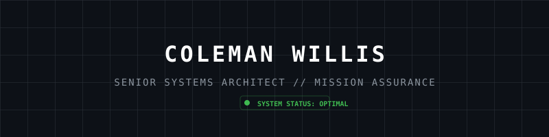

  

# ZoaGrad - Systems Architect

Building deterministic systems for high-stakes environments where "it works most of the time" is not an acceptable operating model.

I work at the intersection of reliability engineering, runtime assurance, AI safety, and distributed systems. The common thread is simple: make fragile systems observable, auditable, and constrained by explicit mechanics instead of vibes.

## The Problem

Modern AI and distributed systems are powerful, but they are often opaque and operationally brittle:

- Observability stacks depend on trained models that can misclassify or hallucinate.
- Recovery paths are too often "restart and hope."
- Audit trails are bolted on after the fact.
- Compliance evidence is difficult to reproduce under stress.

## The Approach

I build physics-first and deterministic systems that:

1. Replace guesswork with mathematics: variance detection, second-order signals, and finite-state correctness.
2. Make failure visible: forensic recording, transition validation, and replayable incident evidence.
3. Preserve sovereignty: read-only observation, minimal privileges, and air-gap compatible deployment models.

## Active Portfolio

| System | Role | Status |
| --- | --- | --- |
| [Coherence SRE](https://github.com/ZoaGrad/coherence-sre) | Variance-based anomaly detection for mission-critical infrastructure | v1.0.0, DOI: [10.5281/zenodo.18002927](https://doi.org/10.5281/zenodo.18002927) |
| [Air-Node](https://github.com/ZoaGrad/air-node) | Finite-state agent validation and forensic incident recording | Prototype |
| [Blackglass Dojo](https://github.com/ZoaGrad/blackglass-dojo) | Adversarial safety testing for AI systems and guardrail failure modes | Active |
| [Sovereign Reliability Lab](https://github.com/ZoaGrad/sovereign-reliability-lab) | Deterministic phase partitioning under stochastic network conditions | Research |
| [Sovereign Embed](https://github.com/ZoaGrad/sovereign-embed) | WASM embedding service for deterministic edge inference | Experimental |

## Verification

The primary systems have been audited for promise-code alignment, edge case behavior, and regression coverage:

- **Coherence SRE:** deterministic rolling-window signals, with amplification edge cases verified.
- **Air-Node:** forensic trail completeness, with repeated violations preserved and tested.
- **Blackglass Dojo:** adversarial safety stack wired end-to-end, with GAMMA scenarios reproducible.

Each hardening pass produced targeted fixes, tests, and merged changes on `main`.

## Why This Matters

High-stakes systems need evidence, not optimism. The work in this portfolio is designed around operational properties that survive contact with real environments:

- Compliance-ready: NIST-aligned design language, deterministic behavior, and deployability in constrained environments.
- Auditable: systems produce forensic records and avoid black-box decision paths.
- Low-risk integration: read-only sidecars and minimal privileged access wherever possible.
- Practical resilience: signals are designed for operators who need to detect drift before it becomes an outage.

## Research & Provenance

**Coherence SRE: A Derivative-Based Anomaly Detection Framework for Mission Assurance**  
Archived at [Zenodo, DOI: 10.5281/zenodo.18002927](https://doi.org/10.5281/zenodo.18002927).

## Contact

- Location: Aurora, Colorado
- Email: [colemanwillis@blackglasscontinuum.com](mailto:colemanwillis@blackglasscontinuum.com)
- Interests: SRE, runtime assurance, AI safety, deterministic observability, distributed systems reliability
